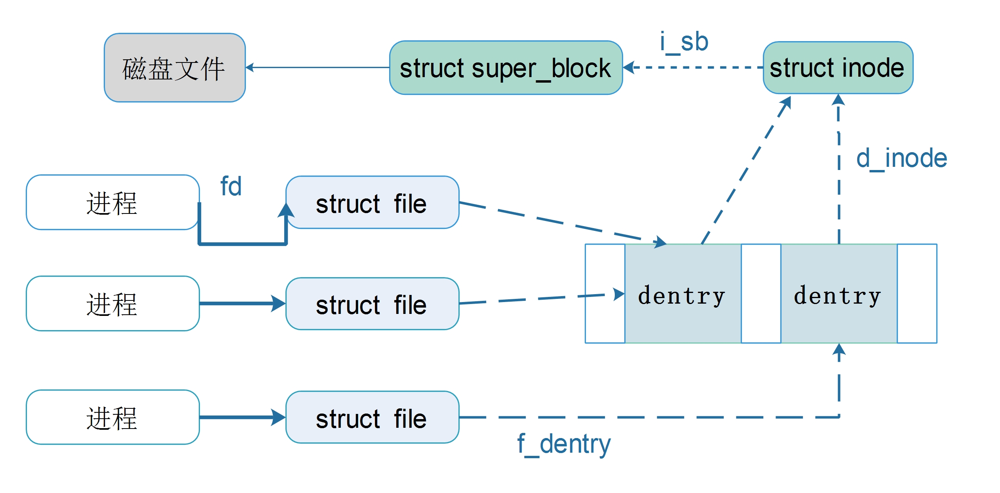

在Linux下编程跟内核打交道的最频繁的方式估计就是操作文件了。谁让Linux遵循“一切皆文件”的思想呢。

因此，咱们学习Linux内核的第一步就是自己动手来写一个简单的文件系统samplefs，希望藉此能够跨入Linux内核的大门。

# 什么是文件系统

有关文件系统的概念，可以在很多操作系统的教材上看到。一般是这样介绍的：

**首先**从计算机存储的层次结构方面讲起，存储介质按访问速度（受限于介质和寻址方式）可以依次分为：

CPU内部寄存器 --> CPU内部缓存（多级） --> 主内存 --> 辅助外部存储（磁盘、flash、软盘等）

内存是按字节存储数据的，CPU直接将要访问的内存地址送到地址总线上即可，无需额外的管理。

但外部存储就不一样了，外存一般用来存放文件（也可用作其它用途，例如Linux swap分区）。不同的操作系统支持的文件类型不一样，
而且不同的文件大小也不一样，每个保存在外存上的文件必须要标记该文件的类型、大小、存放位置等等文件信息（即描述数据属性的数据，元数据）。这些元数据同样要保存在外存上。

因此，如何将文件整齐划一的保存到外存设备上，是操作系统必须要解决的问题。而这个问题的答案就是——文件系统。

## 文件系统的功能

当用户打开计算机，进入系统后，在登陆shell中会自动进入到个人目录（/home/xxx/）下。用户可以看到从根目录（/）开始的文件目录树，可以进入到任何一个目录，打开、修改或删除文件。

因此文件系统的第一个功能就是，负责文件系统中文件的访问操作。

此外，呈现给用户的文件目录信息，都是内核启动时从外部存储设备中读取出来的。而这需要首先将文件系统“安装”到这个外存设备上，在Linux中使用mkfs.xxx工具；在windows中叫做“格式化”。

在安装Linux系统时，需要对磁盘进行分区，而且必须要为“/”根目录建立分区。建立起根分区之后，就可以将其它的已安装有文件系统的设备mount到根目录结构中的某个路径（称作“mount point”）。

## 安装文件系统

比如说，假定我为我的虚拟机（ubuntu 10.04）新添加了一块硬盘，第一步就是为硬盘分区（建立分区表）：

```sh
bookxiaow@ubuntu1004:~$ sudo fdisk -l /dev/sdb

Disk /dev/sdb: 2147 MB, 2147483648 bytes
255 heads, 63 sectors/track, 261 cylinders
Units = cylinders of 16065 * 512 = 8225280 bytes
Sector size (logical/physical): 512 bytes / 512 bytes
I/O size (minimum/optimal): 512 bytes / 512 bytes
Disk identifier: 0x00000000

Disk /dev/sdb doesn't contain a valid partition table

bookxiaow@ubuntu1004:~$ sudo fdisk /dev/sdb
Device contains neither a valid DOS partition table, nor Sun, SGI or OSF disklabel
Building a new DOS disklabel with disk identifier 0xc5c04c60.
Changes will remain in memory only, until you decide to write them.
After that, of course, the previous content won't be recoverable.

Warning: invalid flag 0x0000 of partition table 4 will be corrected by w(rite)

WARNING: DOS-compatible mode is deprecated. It's strongly recommended to
         switch off the mode (command 'c') and change display units to
         sectors (command 'u').
		 
Command (m for help): m
Command action
   a   toggle a bootable flag
   b   edit bsd disklabel
   c   toggle the dos compatibility flag
   d   delete a partition
   l   list known partition types
   m   print this menu
   n   add a new partition
   o   create a new empty DOS partition table
   p   print the partition table
   q   quit without saving changes
   s   create a new empty Sun disklabel
   t   change a partition's system id
   u   change display/entry units
   v   verify the partition table
   w   write table to disk and exit
   x   extra functionality (experts only)
   
Command (m for help): n
Command action
   e   extended
   p   primary partition (1-4)
p
Partition number (1-4): 1
First cylinder (1-261, default 1): 
Using default value 1
Last cylinder, +cylinders or +size{K,M,G} (1-261, default 261): 
Using default value 261

Command (m for help): p

Disk /dev/sdb: 2147 MB, 2147483648 bytes
255 heads, 63 sectors/track, 261 cylinders
Units = cylinders of 16065 * 512 = 8225280 bytes
Sector size (logical/physical): 512 bytes / 512 bytes
I/O size (minimum/optimal): 512 bytes / 512 bytes
Disk identifier: 0xc5c04c60

   Device Boot      Start         End      Blocks   Id  System
/dev/sdb1               1         261     2095458+  83  Linux

Command (m for help): w
The partition table has been altered!
```

现在我们已经建立好分区表了，并且只分了一个区/dev/sdb1，接下来就是安装ext4文件系统了

```sh
bookxiaow@ubuntu1004:~$ sudo mkfs.ext4 -c /dev/sdb1
mke2fs 1.41.11 (14-Mar-2010)
Filesystem label=
OS type: Linux
Block size=4096 (log=2)
Fragment size=4096 (log=2)
Stride=0 blocks, Stripe width=0 blocks
131072 inodes, 523864 blocks
26193 blocks (5.00%) reserved for the super user
First data block=0
Maximum filesystem blocks=536870912
16 block groups
32768 blocks per group, 32768 fragments per group
8192 inodes per group
Superblock backups stored on blocks: 
	32768, 98304, 163840, 229376, 294912

Checking for bad blocks (read-only test): done                                
Writing inode tables: done                            
Creating journal (8192 blocks): done
Writing superblocks and filesystem accounting information: done

This filesystem will be automatically checked every 30 mounts or
180 days, whichever comes first.  Use tune2fs -c or -i to override.
```

最后，就可以挂载到根目录下了

```sh
bookxiaow@ubuntu1004:~$ sudo mkdir /mnt/test
bookxiaow@ubuntu1004:~$ sudo mount -t ext4 /dev/sdb1 /mnt/test
bookxiaow@ubuntu1004:~$ cd /mnt/test/
bookxiaow@ubuntu1004:/mnt/test$ ls
lost+found
```

如果目录/mnt/test已经存在了，并且里面已经了有了文件，那么挂载之后原来的文件内容就被“隐藏”起来了，在unmount之后会再暴露出来！这个小功能是不是可以用来藏东西呢，A_A

# Linux文件系统的结构

Linux中，跟用户直接交互的是VFS（Virtual Filesystem）。它向用户提供了统一的文件操作接口（open/create/close/write/read/...），尽管某些操作在某些文件系统中根本不支持。



在上面的图中，一个磁盘文件必定位于某个安装有特定文件系统（超级块）的分区中，而且对应一个 inode 结构；但是一个inode可能会对应多个目录项dentry，比如说硬链接（注意不是cp）。
对一个目录项，不同的进程可能会同时打开它，因此也就产生了多个`struct file`结构，这样不同的进程就可以设置自己的打开方式和读写偏移量。在某些情况下，也会有同个进程或不同进程内
的多个fd指向同一个`struct file`结构，比如说`dup()/dup2()`或`fork()`之后父子进程。

##进程中的文件表示

对进程而言，一个打开的文件对应于一个进程内唯一的整数fd。这个fd必然是某个数组的索引值。

看一下`struct task_struct`的内容：

```c
struct task_struct {
	/* open file information */
	struct files_struct *files;
};
```

继续看`struct files_struct`的定义：

```c
struct files_struct {
	atomic_t count;
	struct fdtable *fdt;
	struct fdtable fdtab;
	fd_set close_on_exec_init;
	fd_set open_fds_init;
	struct file * fd_array[NR_OPEN_DEFAULT]; /*on i386, NR_OPEN_DEFAULT is 32*/
	spinlock_t file_lock; 
};
```

这里有个 fd_array数组，其元素正是指向`struct file`的指针。因此，可以猜测进程会用fd作索引去这个数组里查找`struct file`。但数组大小只有32，不可能进程只能打开32个文件吧？

那么真实情况是什么样的呢？让我们跟一下write系统调用的实现看看它是怎么从fd找到file指针的吧。

```c
asmlinkage ssize_t sys_read(unsigned int fd, char __user * buf, size_t count)
{
	int fput_needed;
	file = fget_light(fd, &fput_needed);
}
```

要看懂`fget_light`的代码，要先理解[RCU原理](http://blog.chinaunix.net/uid-12260983-id-2952617.html)，因为内核使用RCU来保护`files_struct`的更新。

跟踪代码的结果很诧异，`struct file*`数组并不是`fd_array`，而是`fdt->fd`。至于`fd_array`有啥用，暂时还不清楚。

## 打开的文件——`struct file`

一个打开的文件，在内核中对应一个`struct file`结构体，采用[slab分配器](http://www.ibm.com/developerworks/cn/linux/l-linux-slab-allocator/)来管理创建与回收工作。

文件的属性可分为静态属性和动态属性。静态属性是文件的固有属性，比如文件路径、文件所有者、文件类型等等；而动态属性则在打开文件时才有意义，比如文件打开模式（只读/只写/读写）和文件当前偏移。

在上面的图中可以看到，同个文件可能会有对应多个文件路径，因此从上往下看，file的下一层并不是inode，而是文件目录项dentry，因此需要保存指向dentry结构的指针（`struct dentry *f_dentry）。

同时，file结构又维护文件的动态属性：

```c
struct file {
	struct file_operation *f_op; /*一组文件操作函数指针*/
	atomic_t f_count; /*本结构引用计数*/
	unsigned_int f_flags; /* 文件打开方式 */
	mode_t f_mode; /* 文件是否可读或可写*/
	loff_t f_pos; /*当前偏移量*/
};
```

用户空间对文件的read/write操作最终都是调用`f_op`里的函数。从fd到file结构只需要经过一次转换，看起来好像跟底层文件系统没什么关系，其实关键就是这个`f_op`了。

不同的底层文件系统，在创建文件（file结构）时，会设置`f_op`为指向特定的`struct file_operation`的指针。

## 从文件名到inode的桥梁——目录项dentry

上面提到，`struct file`中只保存有指向`struct dentry`的指针，因此对于打开的文件，`struct dentry`需要保存指向`struct inode`的指针。

另一方面，在open时，内核需要根据文件名pathname来找到该文件对应的inode才能获取到文件数据。如果是新建文件，也需要找到该文件所在目录的inode，才能创建新文件。

因此，如何从pathname定位到inode，也需要借助`struct dentry`。

```c
struct dentry {
	atomic d_count; //引用计数，当大于0时，此dentry不会被释放
	unsigned int d_flags;
    spinlock_t d_lock;      /* per dentry lock */
    struct inode *d_inode;      /* Where the name belongs to - NULL is
                     * negative */
    /*  
     * The next three fields are touched by __d_lookup.  Place them here
     * so they all fit in a cache line.
     */
    struct hlist_node d_hash;   /* lookup hash list */
    struct dentry *d_parent;    /* parent directory */
    struct qstr d_name;

    struct list_head d_lru;     /* LRU list */
    /*  
     * d_child and d_rcu can share memory
     */
    union {
        struct list_head d_child;   /* child of parent list */
        struct rcu_head d_rcu;
    } d_u;
    struct list_head d_subdirs; /* our children */
    struct list_head d_alias;   /* inode alias list */
    unsigned long d_time;       /* used by d_revalidate */
    struct dentry_operations *d_op;
    struct super_block *d_sb;   /* The root of the dentry tree */
    void *d_fsdata;         /* fs-specific data */
    int d_mounted; //挂载在本目录上的文件系统计数
    unsigned char d_iname[DNAME_INLINE_LEN_MIN];    /* small names */
};
```

关于文件路径的解析，在下一篇文章中学习。

## 描述文件数据的数据——inode

inode包含了文件的静态信息，比如以下字段：

```c
struct inode {
	unsigned long i_ino; /* inode编号，全局唯一*/
	atomic_t i_count; /* 引用计数器 */
	umode_t i_mode; /* 文件类型与访问权限 */
	unsigned int i_nlink; /* 硬链接数目 */
	uid_t i_uid; /* 所有者标示 */
	gid_t i_gid; /* 组标识符*/
	dev_t i_rdev; /* 所属设备标识符*/
	loff_t i_size; /* 文件字节数 */
	struct timespec i_atime; /* 上次访问文件时间 */
	struct timespec i_mtime; /* 上次写文件时间 */
	struct timespec i_ctime; /* 上次修改inode信息时间*/
	unsigned int i_blkbits; /*块的位数*/
	unsigned long i_blksize; /*块大小*/
	unsigned long i_blocks; /* 文件占用块数 */
	unsigned short i_bytes; /* 最后一个块的占用字节数，i_size = (i_blocks-1) * i_blksize + i_bytes */
	
	struct inode_operations *i_op; /* 指向inode操作函数的指针 */
	struct file_operations *i_fop; /* 指向文件操作函数的指针 */
	
	struct super_block *i_sb; /*指向超级块的指针*/
};
```

只要知道了文件的inode，就可以找到对应的磁盘，再访问相应的块位置和大小就可以访问该文件了。而且inode还维护了文件的uid,gid和mode等信息。

inode还保存了指向inode_operations的指针，这样在某个目录下创建、删除、重命名文件或目录时，只要调用该目录的inode->i_op所指向的函数即可。

```c
struct inode_operations {
	int (*create) (struct inode *,struct dentry *,int, struct nameidata *); //在目录下为相应的dentry对象创建一个新的inode
	struct dentry * (*lookup) (struct inode *,struct dentry *, struct nameidata *);
	int (*link) (struct dentry *,struct inode *,struct dentry *);
	int (*unlink) (struct inode *,struct dentry *); //从一个目录中删除dentry对应文件的硬链接（即删除文件操作，只是更新硬链接数量，如果为0才真正删除文件数据）
	int (*symlink) (struct inode *,struct dentry *,const char *);
	int (*mkdir) (struct inode *,struct dentry *,int);
	int (*rmdir) (struct inode *,struct dentry *);
	int (*mknod) (struct inode *,struct dentry *,int,dev_t);
	int (*rename) (struct inode *, struct dentry *,
			struct inode *, struct dentry *);
	int (*readlink) (struct dentry *, char __user *,int);
	void * (*follow_link) (struct dentry *, struct nameidata *);
	void (*put_link) (struct dentry *, struct nameidata *, void *);
	void (*truncate) (struct inode *);
	int (*permission) (struct inode *, int, struct nameidata *);
	int (*setattr) (struct dentry *, struct iattr *);
	int (*getattr) (struct vfsmount *mnt, struct dentry *, struct kstat *);
	int (*setxattr) (struct dentry *, const char *,const void *,size_t,int);
	ssize_t (*getxattr) (struct dentry *, const char *, void *, size_t);
	ssize_t (*listxattr) (struct dentry *, char *, size_t);
	int (*removexattr) (struct dentry *, const char *);
	void (*truncate_range)(struct inode *, loff_t, loff_t);
};
```

普通磁盘文件的inode信息当然是取自其所在的磁盘，而且像i_op和i_fop也要跟底层文件系统对应才行。而这些信息都需要借助超级块结构。

## 如何描述文件系统——super_block

每mount一个文件系统分区到内核，都会有一个相应的super_blcok被创建。

系统内所有的super block被组织成一条双向循环链表，链表头是一个全局变量`super_blocks`。

```c
extern struct list_head super_blocks;
extern spinlock_t sb_lock; // protect the list

struct super_block {
	struct list_head s_list; // 链接到链表
};
```

super block首先保存了描述块设备分区的信息，例如块大小、最大允许文件大小、是否包含脏数据等。

```c
struct super_block {
	dev_t				s_dev; //块设备号
	unsigned long       s_blocksize;//块block大小
	unsigned char       s_blocksize_bits;
	unsigned char       s_dirt;//内存中的超级块信息同磁盘超级块信息是否一致，即是否需要同步
	unsigned long long  s_maxbytes; /* Max file size */
	unsigned long       s_flags;
	unsigned long       s_magic;
	struct dentry       *s_root;//该分区根目录dentry

	struct block_device *s_bdev;
	void				*s_fs_info; /* Filesystem private info */
};
```

super block在执行mount操作时创建，同时也会将挂载点的dentry与该super block关联起来，这样用户才能通过系统的根目录树来操作这个分区。

此外，super block还维护了当前分区下所有的文件的链表、所有被修改了的文件的链表以及所有等待写会磁盘的文件的链表。

```c
struct super_block {
	struct list_head    s_inodes;   /* all inodes */
	struct list_head    s_dirty;    /* dirty inodes */
	struct list_head    s_io;       /* parked for writeback */
	struct hlist_head   s_anon;     /* anonymous dentries for (nfs) exporting */
	struct list_head    s_files;
};
```

总之，无论是file结构，inode结构还是super_block结构，这些都是VFS抽象出来的、用于统一描述各文件系统的接口，最终的信息仍然需要从底层文件系统获取。

C语言中总能通过函数指针来达到面向对象的效果，因此在Linux 文件系统架构中，总能发现下层对象负责创建上层对象的同时，会设置好一组接口函数。

另一方面，不同的文件系统可能需要维护额外的信息，这些信息格式不一，需要在层与层间交换时会很不方便。C语言可以通过`void *`来解决这个问题。

例如，在`struct super_block`中有个指针`s_fs_info`就是保存了文件系统私有数据，其意义由各文件系统自己解析。

此外，对于磁盘文件系统，写操作总是先写到内存，再同步回磁盘，因此内存和磁盘之间的同步机制也是磁盘文件系统需要着重考虑的东西。


## 文件系统类型 file_system_type

在一开始我们执行mount时，总是需要指定文件系统类型（例如ext4）。这个文件系统类型必须是内核能识别的。

什么样的文件系统是内核能识别的呢？换言之，如果我自己定义一种新的文件系统，怎么样能让内核识别呢？

答案就是，你要先把它注册到内核中去。

注册的对象是`struct file_system_type`,注册的方法是`int register_filesystem(struct file_system_type * fs)`。

```c
struct file_system_type {
    const char *name; //名称，例如 "ext4"
    int fs_flags; // 标记
    int (*get_sb) (struct file_system_type *, int, 
               const char *, void *, struct vfsmount *); // 读取一个超级块
    void (*kill_sb) (struct super_block *); // 删除一个超级块
    struct module *owner;
    struct file_system_type * next; //指向下一个file_system_type
    struct list_head fs_supers; // 所有本类型的super_block组成的链表，这里是链表头
    struct lock_class_key s_lock_key;
    struct lock_class_key s_umount_key;
};
```

系统内所有注册成功的file_system_type组成一条单链表，链表头是全局变量`file_systems`。调用`register_filesystem`其实就是将其append到链表尾部。
当然前提是它之前没有被注册过（按name来查找）。

在注册了文件系统类型之后，再执行mount操作，内核就通过`get_sb`函数指针调用该文件系统特定的函数就知道如何创建属于该文件系统类型的super_block。

# 挂载文件系统

## 根目录

根目录下有什么文件？答案很简单，只要ls或tree查看一下即可

```sh
bookxiao@ubuntu-kernel:~/src/linux-2.6.20$ tree -d -L 1
.
├── arch
├── block
├── crypto
├── Documentation
├── drivers
├── fs
├── include
├── init
├── ipc
├── kernel
├── lib
├── mm
├── net
├── scripts
├── security
├── sound
└── usr
```

但并不是说每个进程的根目录都是系统根目录（system's root filesystem）。进程的根目录信息保存在它的namespace中，且子进程或线程会继承父进程的namespace。

```c
struct task_struct {
	/* namespaces */
    struct nsproxy *nsproxy;
};

struct nsproxy {
    atomic_t count;
    spinlock_t nslock;
    struct uts_namespace *uts_ns;
    struct ipc_namespace *ipc_ns;
    struct mnt_namespace *mnt_ns;
    struct pid_namespace *pid_ns;
};

struct mnt_namespace {
    atomic_t        count;
    struct vfsmount *   root; // 根文件系统
    struct list_head    list; //所有挂载在本namespace下的文件系统
    wait_queue_head_t poll;
    int event;
};
```

一个namespace有一个根文件系统，且所有挂载在该根文件系统下的其它所有文件系统组成一张双向循环链表。

在系统初始化时内核为init进程创建了namespace与根文件系统，而默认下的fork操作（不带CLONE_NEWNS参数的clone）不会创建新的namespace。
所以所有用户进程的默认namespace和根文件系统与init进程一致，其根文件系统都是系统根文件系统。

## 挂载操作 vfsmount

每个文件系统都拥有一个自己的文件目录树，根文件系统作为一个特殊的文件系统，它的目录树被用来作为总的目录树，其它文件系统的目录树都需要挂载到
它的某个子目录上（挂载点）。

将文件系统自己的目录树和挂载点区分开来很关键。比如说，我将一个分区挂载到`/mnt/test/`下，然后在该目录下创建一个文件file.txt，那么我们可以通过`/mnt/test/file.txt`来定位该文件。
然后我们将其卸载，再将它挂载到`/mnt/test2/`下，这时候我们可以通过`/mnt/test2/file.txt`来定位该文件。

Linux允许我们同时将一个分区挂载到多个不同的挂载点上，这样通过不同的文件路径我们都可以访问该分区下的文件。但一个分区在内核中只对应一个super_block，那如何表示不同的挂载点呢？

Linux为每一次挂载操作定义一个**vfsmount**来表示。

```c
struct vfsmount {
    struct list_head mnt_hash;
    struct vfsmount *mnt_parent;    /* fs we are mounted on */
    struct dentry *mnt_mountpoint;  /* dentry of mountpoint */
    struct dentry *mnt_root;    /* root of the mounted tree */
    struct super_block *mnt_sb; /* pointer to superblock */
    struct list_head mnt_mounts;    /* list of children, anchored here */
    struct list_head mnt_child; /* and going through their mnt_child */
    atomic_t mnt_count;
    int mnt_flags;
    int mnt_expiry_mark;        /* true if marked for expiry */
    char *mnt_devname;      /* Name of device e.g. /dev/dsk/hda1 */
    struct list_head mnt_list;
    struct list_head mnt_expire;    /* link in fs-specific expiry list */
    struct list_head mnt_share; /* circular list of shared mounts */
    struct list_head mnt_slave_list;/* list of slave mounts */
    struct list_head mnt_slave; /* slave list entry */
    struct vfsmount *mnt_master;    /* slave is on master->mnt_slave_list */
    struct mnt_namespace *mnt_ns;   /* containing namespace */
    int mnt_pinned;
};
```

挂载的文件系统只有在第一次挂载时才会新建`super_block`结构，其中`s_root`指向的是挂载点的dentry。随后的挂载操作并不会创建新的super block。

# 总结

在研究Linux 内核文件系统的实现细节之前，先弄懂各个结构体的作用，因此本文仅介绍几本概念，忽略了很多实现上的细节，这些内容将在后续的学习中继续分析。

# 参考资料

1. Understanding the Linux Kernel, 3rd, Daniel P. Bovet / Marco Cesati
2. [解析 Linux 中的 VFS 文件系统机制](https://www.ibm.com/developerworks/cn/linux/l-vfs/)
3. Linux Source Code(linux-2.6.20) & Linux Doc
